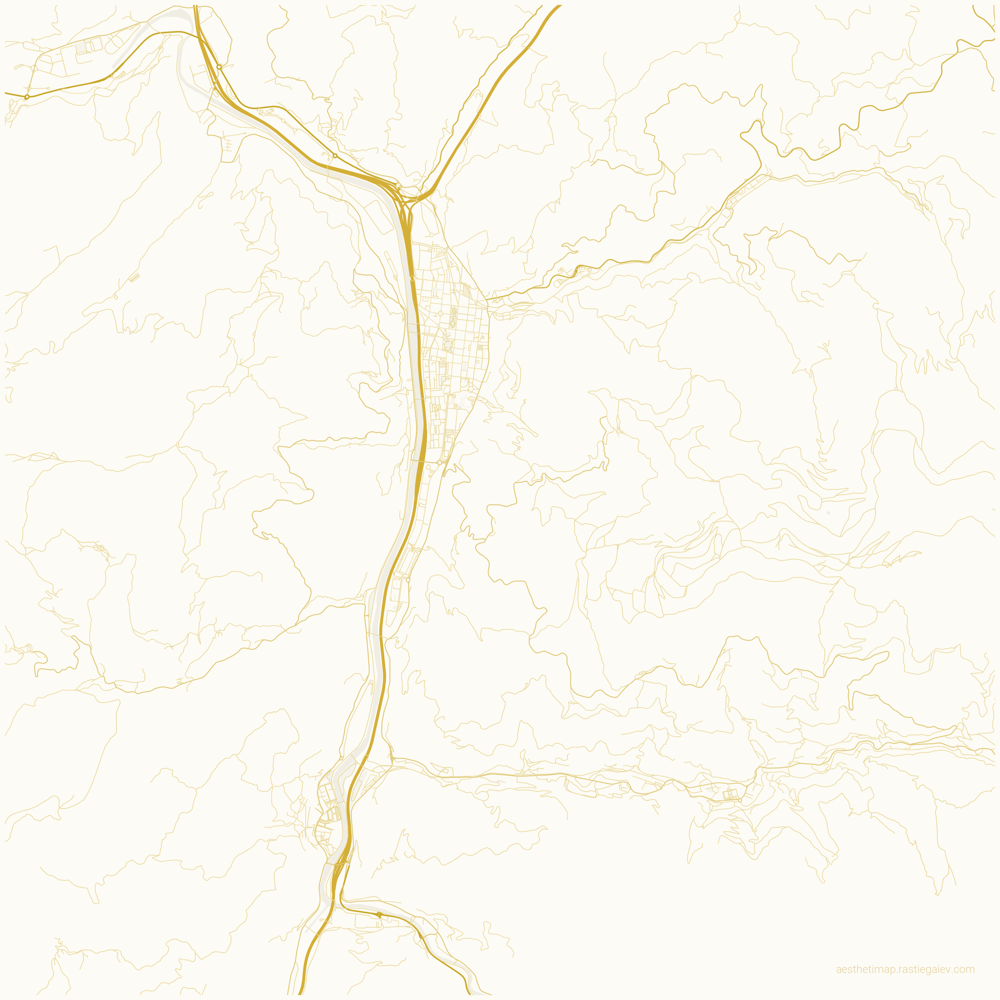

# 🎨 AesthetiMap

Generate stunning, customizable map art posters for any city in the world using OpenStreetMap data.



## ✨ Features

- **Global Coverage**: Any city, town, or village via OpenStreetMap.
- **Curated Themes**: Choose from 15+ designer themes (Noir, Gold on Porcelain, Neon Cyberpunk, etc.).
- **Customizable Layouts**: Positioning controls (Top/Bottom/Center), Toggle-able gradients.
- **High Resolution**: Optimized for printing up to 40" (Free tier limited to 20").
- **Multiple Formats**: Export as PNG, SVG, or PDF.

## 🚀 Quick Start (Docker)

The easiest way to run AesthetiMap is via Docker Compose:

```bash
# Clone the repository
git clone git@github.com:truesysadmin/AesthetiMap.git
cd AesthetiMap

# Start the application
docker compose up -d
```

Access the UI at: **http://localhost:3000**

## 🛠️ Usage (CLI)

You can also run the renderer script directly if you have Python installed:

```bash
python renderer.py --city "Kyiv" --country "Ukraine" --theme gold_on_porcelain --span 20000
```

### Options:
- `--city`, `-c`: City name (required)
- `--country`, `-C`: Country name (required)
- `--theme`, `-t`: Theme name (default: terracotta)
- `--span`, `-d`: Map coverage (total span) in meters (default: 20000)
- `--width`, `-W`: Width in inches (max 40)
- `--height`, `-H`: Height in inches (max 40)
- `--format`, `-f`: Output format (png, svg, pdf)
- `--text-position`: `top`, `bottom`, or `center`

## 💎 Premium Features (Roadmap)
- **Vector Tiles (MVT)**: Sub-second rendering.
- **Custom Fonts**: Google Fonts integration.
- **Task Queuing**: Redis/Celery for handling multiple high-res jobs.
- **Authentication**: JWT-based premium tiers.

## ⚖️ License

Distributed under the MIT License. See `LICENSE` for more information.

---
Created by **Denys Rastiegaiev**
